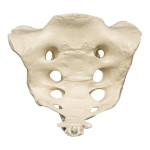

## Coding Best Practices (10 min.)

__SACRUMS__: Our top 7 coding best practices

* **S**tandardize: on a coding style (for you and your group)
* **A**utomate: by using formatters and validators to conform to your style
* **C**omment your code and use descriptive, standardized variable names
* **R**euse code: with loops and functions instead of copy/paste duplication
* **U**se portable file paths: platform-neutral, "relative" over "absolute"
* **M**ake it secure: keep usernames, passwords, API keys, etc. out of your code
* **S**tore configuration parameters in a separate text file (for larger projects)



## Standardize and Automate

Standardize on a coding style (for you and your group).

Recommendations:

* Python: [PEP8](https://www.python.org/dev/peps/pep-0008/)
* R: [Google's R Style Guide](https://google.github.io/styleguide/Rguide.xml)

Automate by using formatters and validators to conform to your style:

* Python: [autopep8](https://pypi.org/project/autopep8/)
* RStudio: Use **Ctrl-Shift-A** to "Reformat Code"

## Comment your code

Comment your code and use descriptive, standardized variable names.

Where ...


```r
a <- c('John', 'Wayne')
b <- paste(a, collapse = " ")
```

Becomes ...


```r
# Combine first and last name strings into a single string
fname_lname <- c('John', 'Wayne')
full_name <- paste(fname_lname, collapse = " ")
```

## Reuse code

Reuse code with loops and functions instead of copy/paste duplication.

Where ...


```r
setosa_mean_sepal_width <- mean(iris[iris$Species == "setosa", "Sepal.Width"])
versicolor_mean_sepal_width <- mean(iris[iris$Species == "versicolor", "Sepal.Width"])
virginica_mean_sepal_width <- mean(iris[iris$Species == "virginica", "Sepal.Width"])
```

Becomes ...


```r
mean_sepal_width <- sapply(unique(iris$Species), function(x) { 
    mean(iris[iris$Species == x, "Sepal.Width"])})
```

Or even ...


```r
if (!require("dplyr")) install.packages("dplyr")
library(dplyr)
mean_sepal_width <- iris %>% 
    group_by(Species) %>% 
    summarize(mean = mean(Sepal.Width))
```


## Use portable file paths

Use portable file paths, preferring platform-neutral, "relative" paths.

Where ...


```r
# This absolute path only works on Windows with this exact folder structure.
df <- read.csv("X:\\health\exercise\\data\\fitbit.csv")
```

Becomes ...


```r
# This relative path "should" work on any system with this subfolder in place.
df <- read.csv("data/fitbit.csv")
```

Or even ...


```r
# The file.path() function ensures the relative path is platform-neutral.
df <- read.csv(file.path("data", "fitbit.csv"))
```


## Make it secure

Keep usernames, passwords, API keys, etc. out of your code.

Where ...


```r
# Database password
db_password <- "s3ktr!t"
```

Becomes ...


```r
# Read password from a separate file stored in a more secure place
db_password <- readLines(file.path("~", "pass.txt"))
```

Or even ...


```r
# Read password from a pop-up prompt so that it isn't stored on disk
db_password <- rstudioapi::askForPassword("Please enter your password")
```

## Store configuration parameters

Store configuration parameters in a separate text file (especially for larger projects).

Where ...


```r
config <- list()
config$ncores <- 6
config$data_dir <- "data"
config$output_dir <- "output"
```

Becomes ...


```r
if (!require("config")) install.packages("config")
config <- config::get(file = file.path("conf", "config.yml"))
```

.... if you have a `config.yml` file like this (stored in the location specified):

```
default:
  ncores: 6
  data_dir: "data"
  output_dir: "output"
```

## More Best Practices

There are many more coding best practices, and some are just as important as 
these.

Look to your coding community for a comprehensive list suitable for the kind 
of work you do and the tools you use.

Work with your collaborators to identify those practices which matter most 
and standardize on them.

Seek to implement best practices with other aspects of your work, such as 
data management, version control, and reproducibility.

You can find a comprehensive list of [Research Computing Best Practices](https://portal.deohs.washington.edu/node/1455) on [DEOHS Portal](https://portal.deohs.washington.edu).
